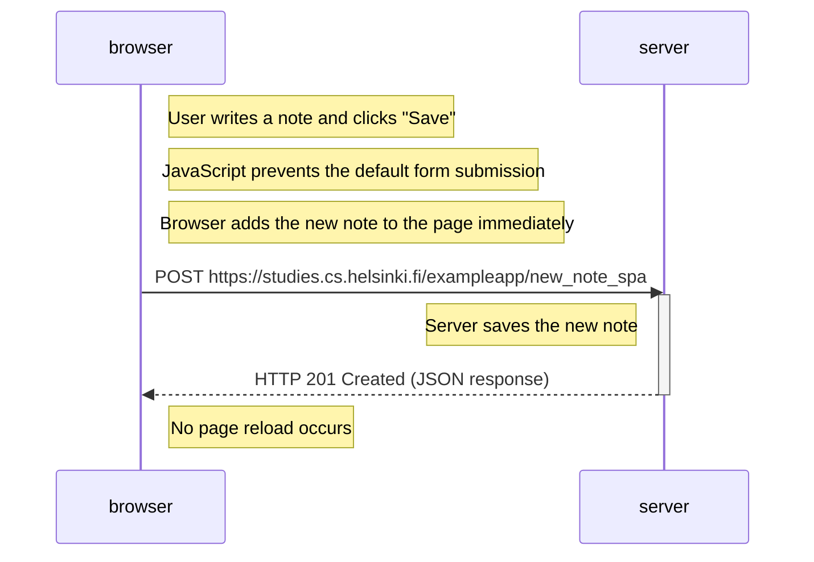

```mermaid
    sequenceDiagram
        participant browser
        participant server

        Note right of browser: User writes a note and clicks "Save"

        Note right of browser: JavaScript prevents the default form submission

        Note right of browser: Browser adds the new note to the page immediately

        browser->>server: POST https://studies.cs.helsinki.fi/exampleapp/new_note_spa
        activate server
        Note left of server: Server saves the new note
        server-->>browser: HTTP 201 Created (JSON response)
        deactivate server

        Note right of browser: No page reload occurs
```